.. include:: define.rst

Eclipse
=========================

Downloading Eclipse IDE
-----------------------
You can download Eclipse IDE from this page

- http://www.eclipse.org/downloads/

Download a newest version of “Eclipse IDE for Java EE Developers".
Recent version now is “Indigo (3.7)”

Installing Eclipse
------------------

Unpack the downloaded file and move **eclipse** folder to your home
directory.  In this document, we use |eclipse|.

Start Eclipse by double clicking the eclipse icon.

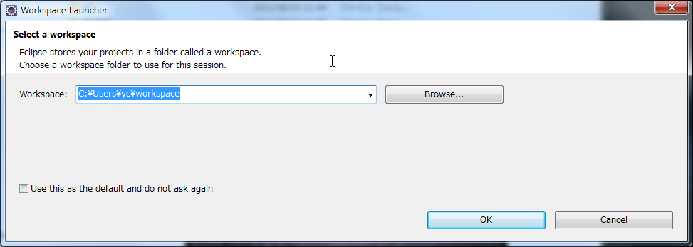

Click OK button.

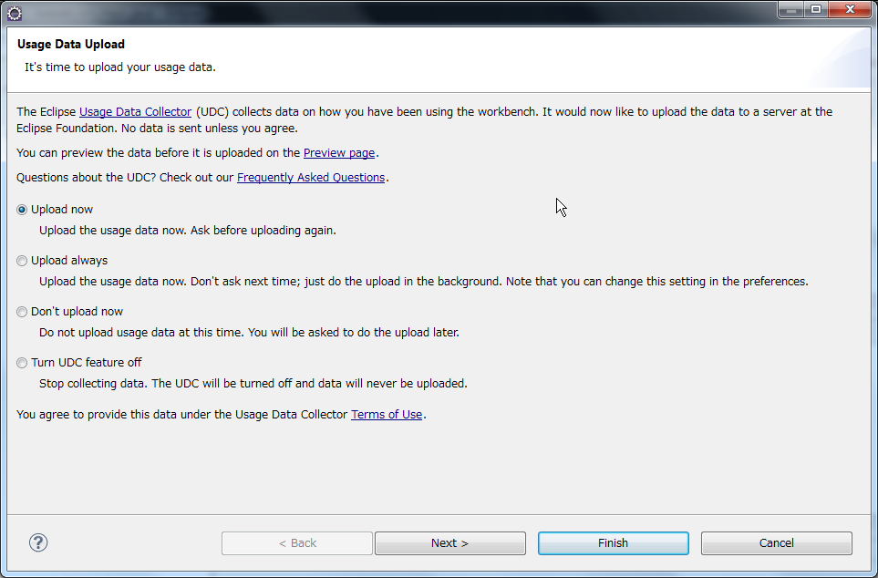

Click Finish button.

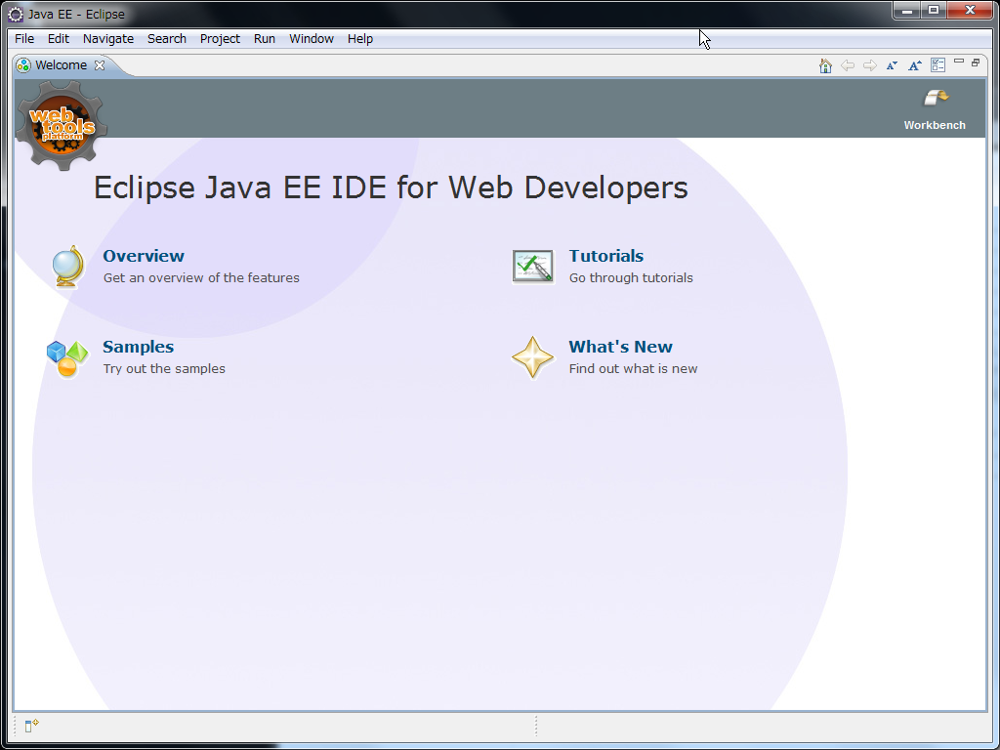

Click Workbench button.

.. image:: image/20110814125341.png
   :width: 480 px

Creating 'Hello World' project
------------------------------

Let us create a 'Hello World' project.

Choose File:New:Other... menu item.

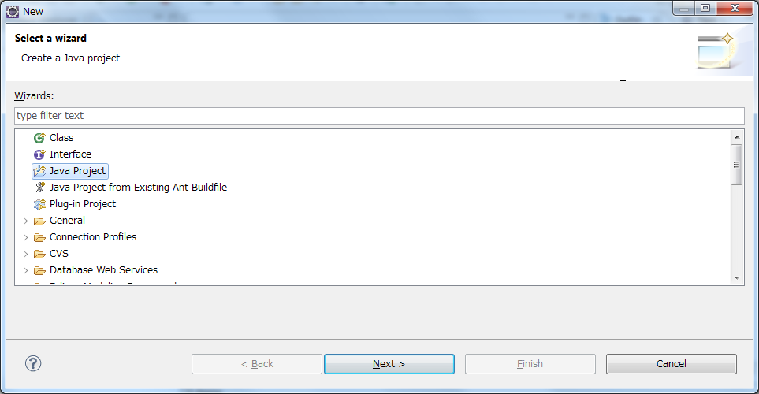

Select *Java Project* and push *Next* button.

Type 'Hello World' in *Project name* text box.

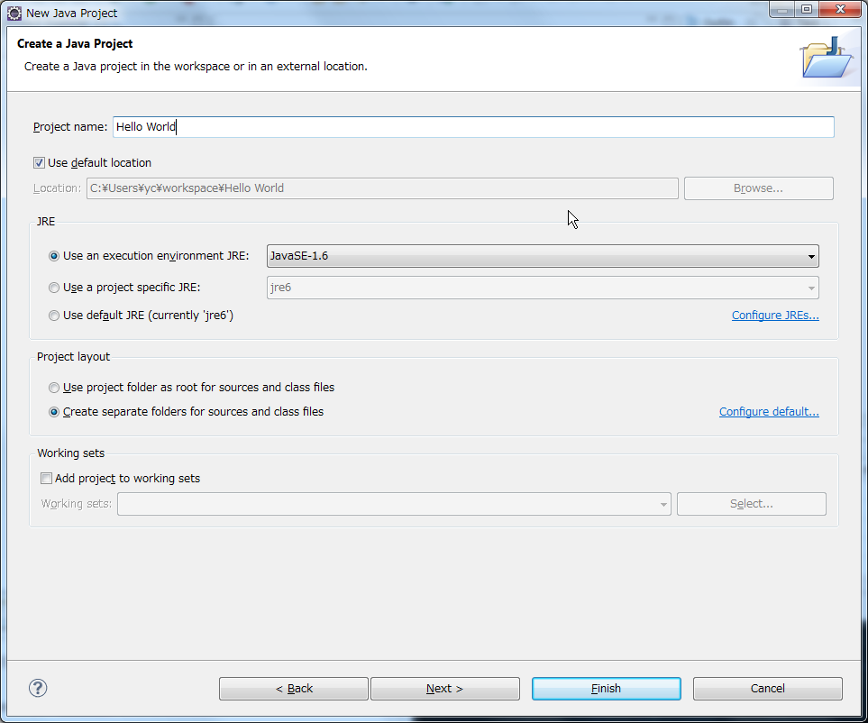

Push *Finish* button.  'Open Associated Perspective?' daialog well be appeared.  Check *Remember my decision*.

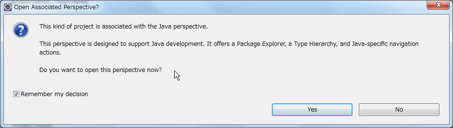

Click *Yes* button.

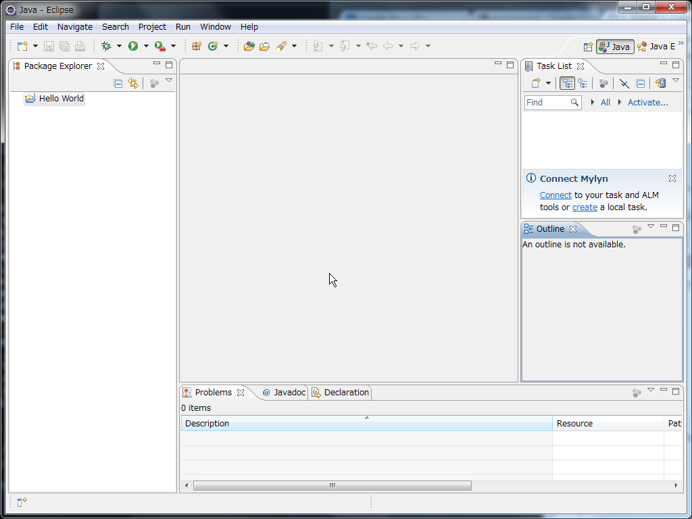

You will see a new 'Hello World' project in *Package Explorer* view.

Adding  a class (.java) file
----------------------------

Coose *File:New:Class* menu. Type "HelloWorld" in *Name* field.

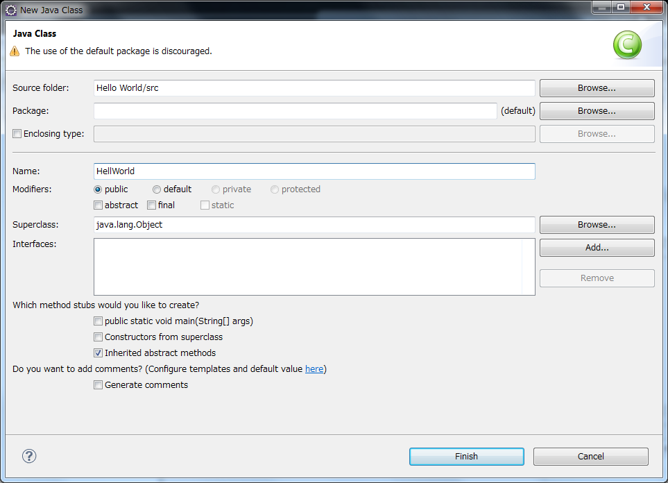

Click *Finish*.

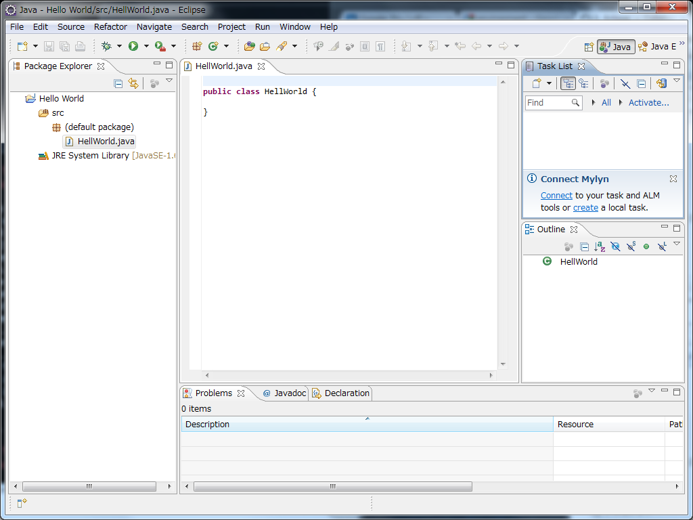

Copy-and-paste following code.

::

	public class HellWorld {
		public static void main(String[] args) {
			System.out.println("Hello world");
		}
	}

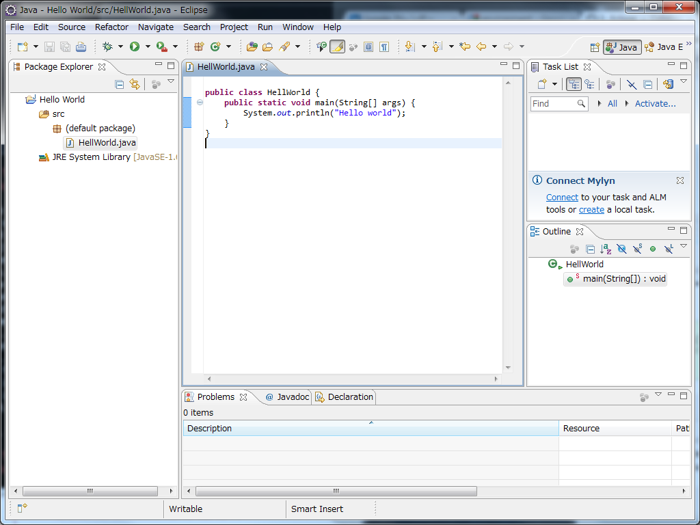

Running the code
----------------

Run the code by choosing *Run:Run last launched (or Run:Run)* menu.

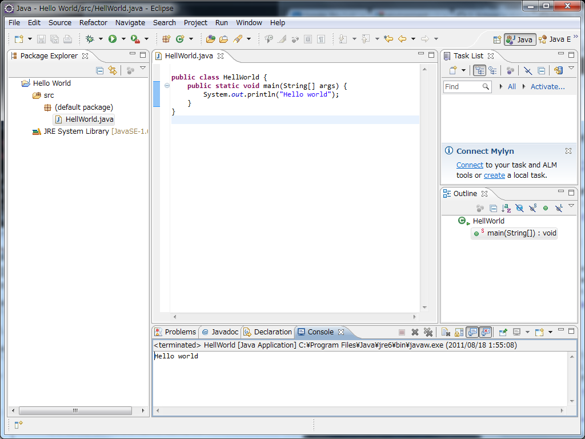

The result is shown in the *Console* view.

Exercise
--------

#. Open your home directory (|user home|) and find your *workspace* folder.  Check that Hello World project is located in the folder.
#. Find your HelloWorld.java file in the project folder.
#. Find your HelloWorld.class file in the project folder.
#. Change the message string in HelloWorld.java as you like.  Run the new code and check its result.
#. You can create a new project or a new class file by using the right-mouse-button.  Try it out.

Refferences
-----------
#. http://ist.berkeley.edu/as-ag/tools/howto/install-eclipse-win.html
