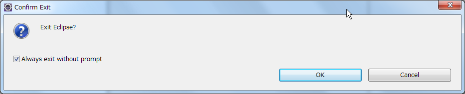

.. include:: define.rst

Eclipse
=========================

Installing Eclipse
------------------

Downloading Eclipse IDE
~~~~~~~~~~~~~~~~~~~~~~~
You can download Eclipse IDE from this page.

- http://www.eclipse.org/downloads/

- Download a newest version of “Eclipse IDE for Java EE Developers".
  Recent version is “Indigo (3.7)”now (Aug. 2011).
- Unpack the downloaded file and move the created folder to your home directory ( In this document, we use |eclipse| ).

Starting Eclipse
~~~~~~~~~~~~~~~~

Let us start Eclipse and move to its Workbench screen.

- Start Eclipse by double clicking the eclipse icon.
- Check 'Use this as the default and do not ask again'.

.. image:: image/20110814125041.png
   :width: 480 px

- Click OK button.

.. image:: image/20110814125147.png
   :width: 480 px

- Click Finish button.

.. image:: image/20110814125325.png
   :width: 480 px

- Click Workbench button.

.. image:: image/20110814125341.png
   :width: 480 px

Closing Eclipse
~~~~~~~~~~~~~~~
- Click 'x' button at the top-right corner of Eclipse window.
- Check 'Always exit without prompt'.

- Click OK button.

Using Eclipse
-------------

Creating 'Hello World' project
~~~~~~~~~~~~~~~~~~~~~~~~~~~~~~

Let us create a 'Hello World' project.

- Start Eclipse again.
- Choose File:New:Other... menu item.

.. image:: image/20110818011053.png
   :width: 480 px

Select *Java Project* and push *Next* button.

Type 'Hello World' in *Project name* text box.

.. image:: image/20110818011414.png
   :width: 480 px

Push *Finish* button.  'Open Associated Perspective?' daialog well be appeared.  Check *Remember my decision*.

.. image:: image/20110818011717.png
   :width: 480 px

Click *Yes* button.

.. image:: image/20110818012106.png
   :width: 480 px

You will see a new 'Hello World' project in *Package Explorer* view.

Adding  a class (.java) file
----------------------------

Coose *File:New:Class* menu. Type "HelloWorld" in *Name* field.

.. image:: image/20110818013804.png
   :width: 480 px

Click *Finish*.

.. image:: image/20110818014143.png
   :width: 480 px

Copy-and-paste following code.

::

	public class HellWorld {
		public static void main(String[] args) {
			System.out.println("Hello world");
		}
	}

.. image:: image/20110818015150.png
   :width: 480 px

Running the code
~~~~~~~~~~~~~~~~

Run the code by choosing *Run:Run last launched (or Run:Run)* menu.

.. image:: image/20110818015515.png
   :width: 480 px

The result is shown in the *Console* view.

Exercise
--------

#. Open your home directory (|user home|) and find your *workspace* folder.  Check that Hello World project is located in the folder.
#. Find your HelloWorld.java file in the project folder.
#. Find your HelloWorld.class file in the project folder.
#. Change the message string in HelloWorld.java as you like.  Run the new code and check its result.
#. You can create a new project or a new class file by using the right-mouse-button.  Try it out.

Refferences
-----------

#. `Eclipse IDE Installation Instructions <http://ist.berkeley.edu/as-ag/tools/howto/install-eclipse-win.html>`_
