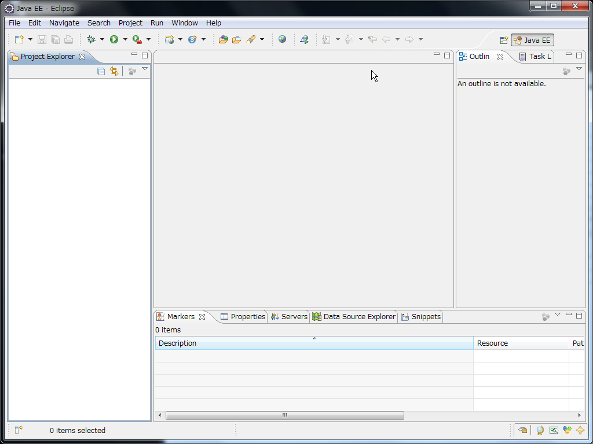

.. include:: define.rst

.. todo:: *TEST*

Eclipse
=========================

Download Eclipse IDE
--------------------
You can download Eclipse IDE from this page

- http://www.eclipse.org/downloads/

Download a newest version of “Eclipse IDE for Java EE Developers".
Recent version now is “Indigo (3.7)”

Install Eclipse
---------------

Unpack the downloaded file and move **eclipse** folder to your home
directory.  In this document, we use |eclipse|.

Start Eclipse by double clicking the eclipse icon.

Click OK button.

.. image:: image/20110814125147.png
   :width: 480 px

Click Finish button.

.. image:: image/20110814125325.png
   :width: 480 px

Click Workbench button.

Hello World project
-------------------

Create a project named "Hello World".

Check point
-----------

- Workspace?
