EGit
====

EGit plugin for Eclipse
-----------------------

See http://eclipse.org/egit/.

Installing EGit plugin
----------------------

- Chose **Help:Install new software...** menu.
- Chose '--All Available Sites--' in **Work with** field.

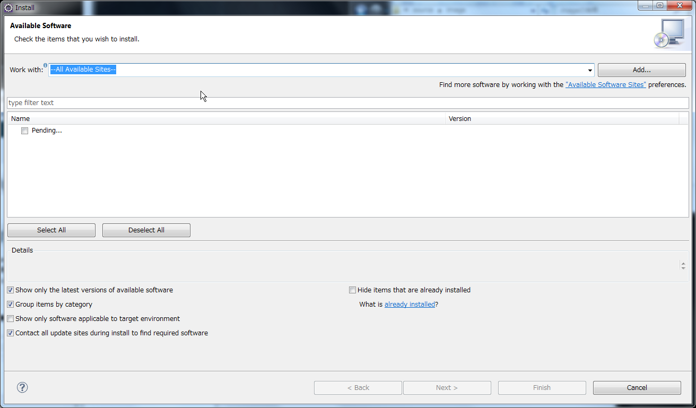

- Wait a second.

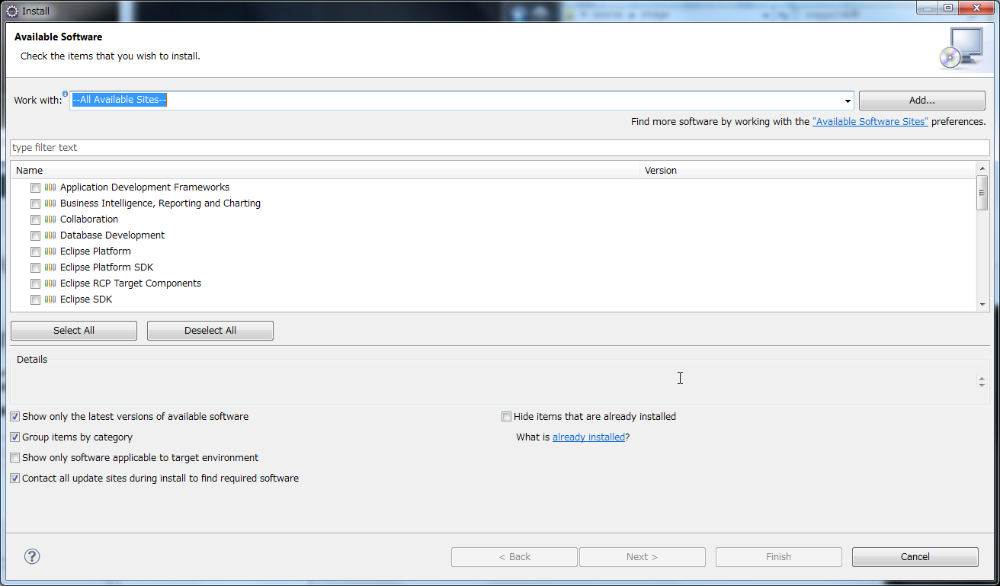

- Input 'egit' at the field which is initially 'type filter text'.
- Wait a second.

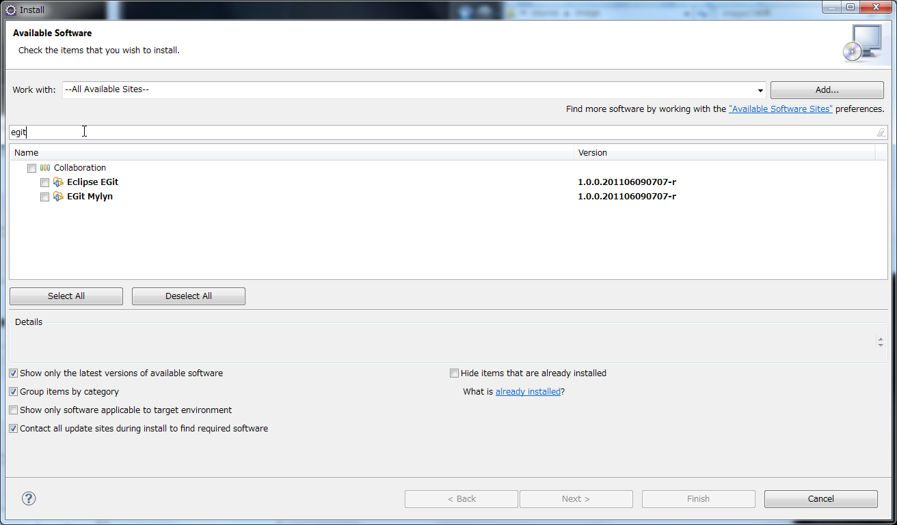

- Press **Select All** button.

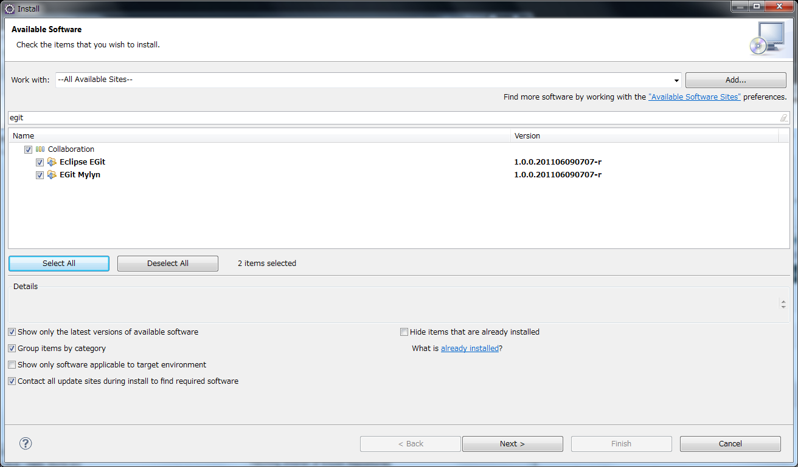

- Press **Next** button.

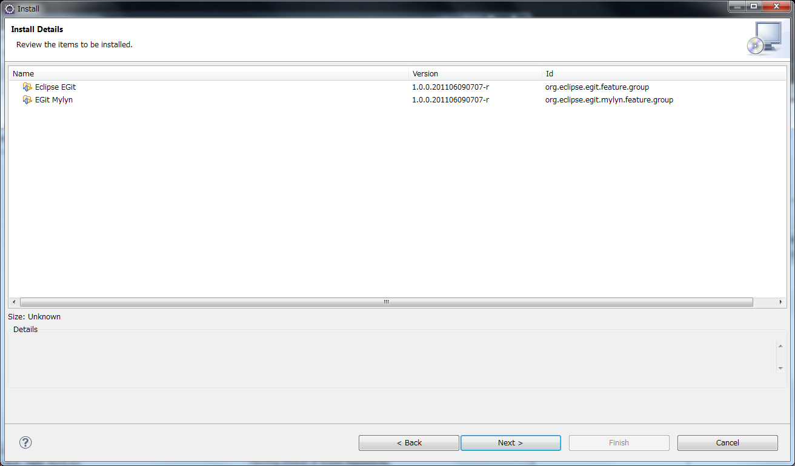

- Press **Next** button again.
- Check **I accept the terms of the license agreement**

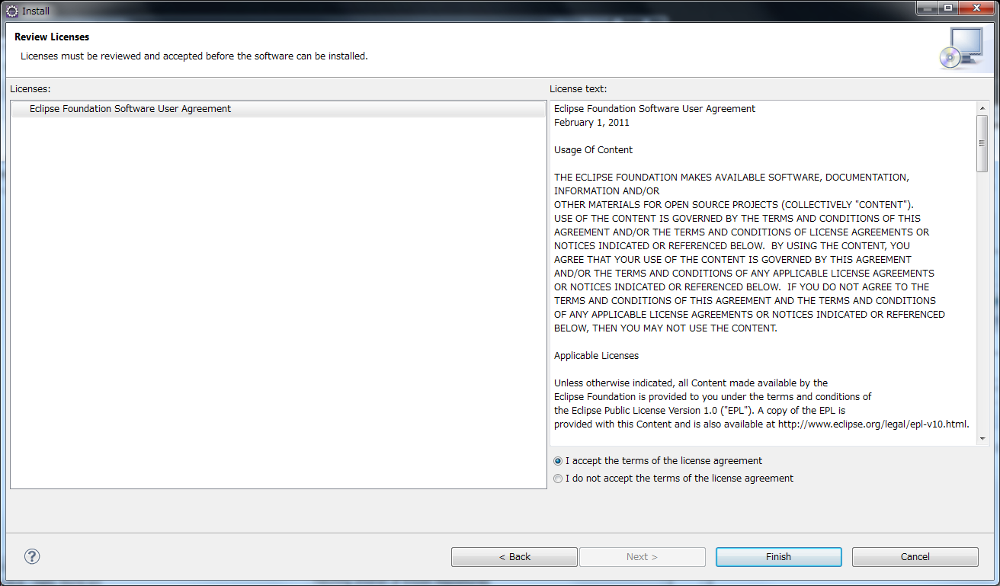

- Press **Finish** button.

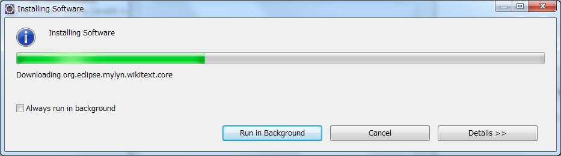

Then next dialog will appear after finishing this download.

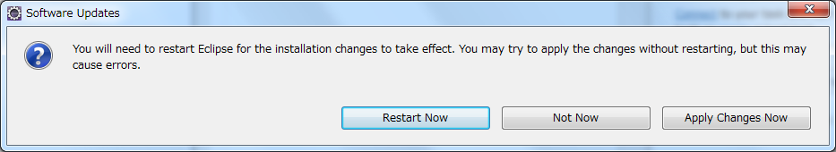

- Click **Restert Now** button.
- Wait a second.

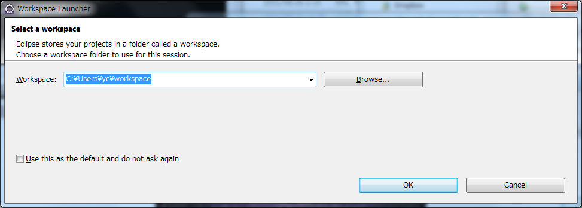

- Press **OK** button.

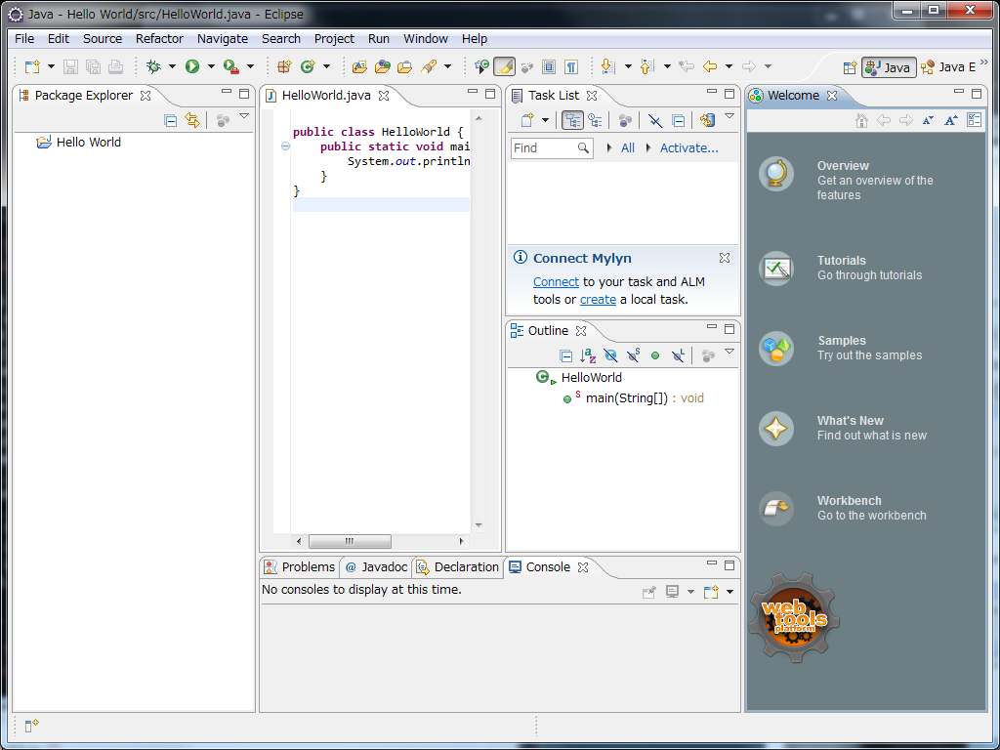

SSH Key
-------

- Select **Window:Preferences** menu.

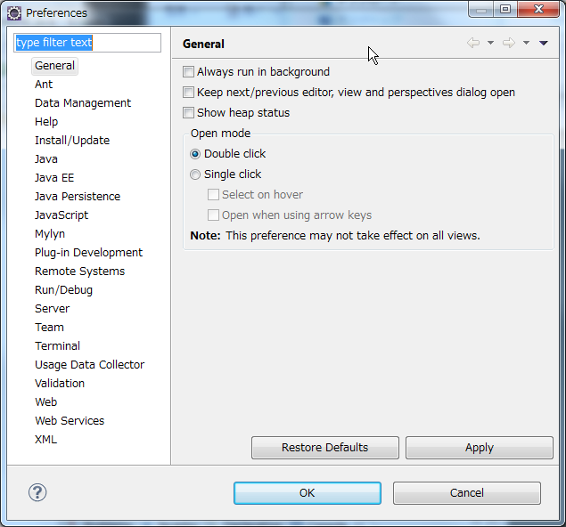

- Type "SSH" at the text box.
- Select **SSH2** item.

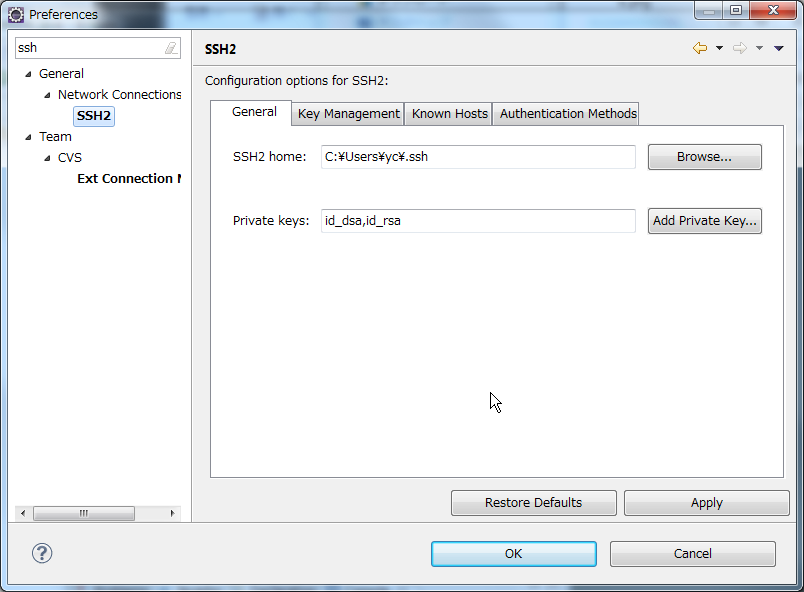

- Click **Key Management** tab.

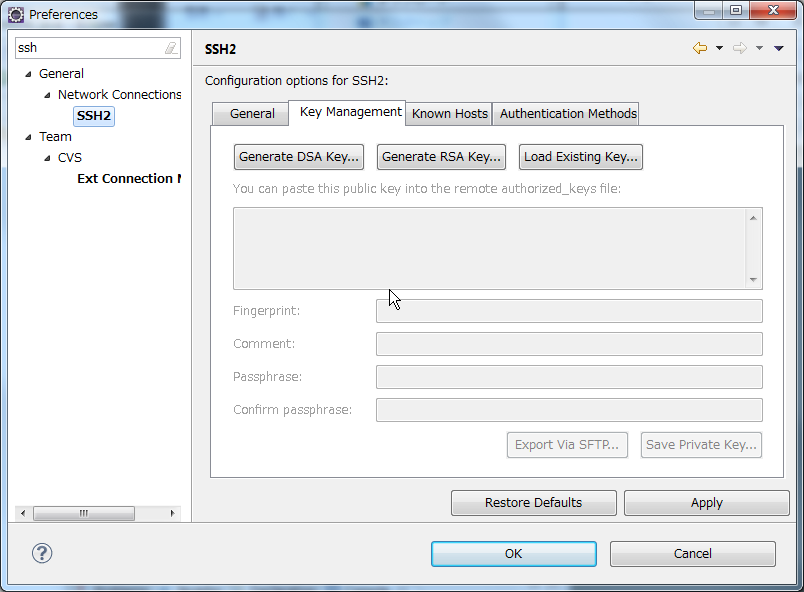

- Click **Generate RSA Key...** tab.

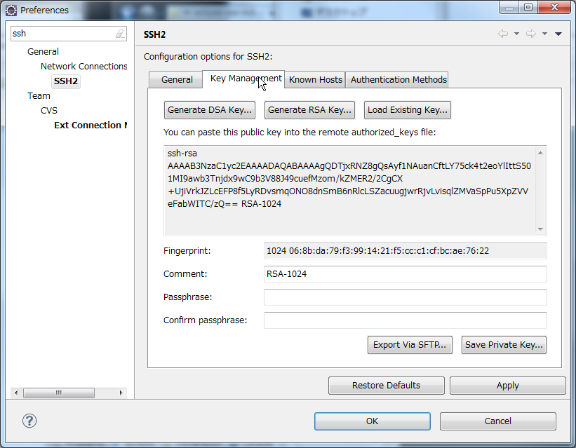

- Click **Save Private Key...** button.

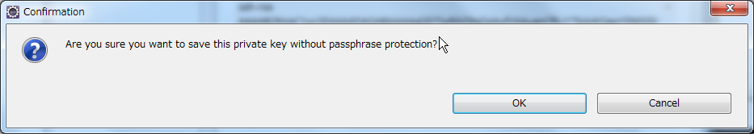

- Click **OK** button.

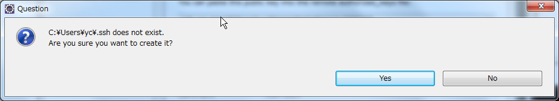

- Click **OK** button.

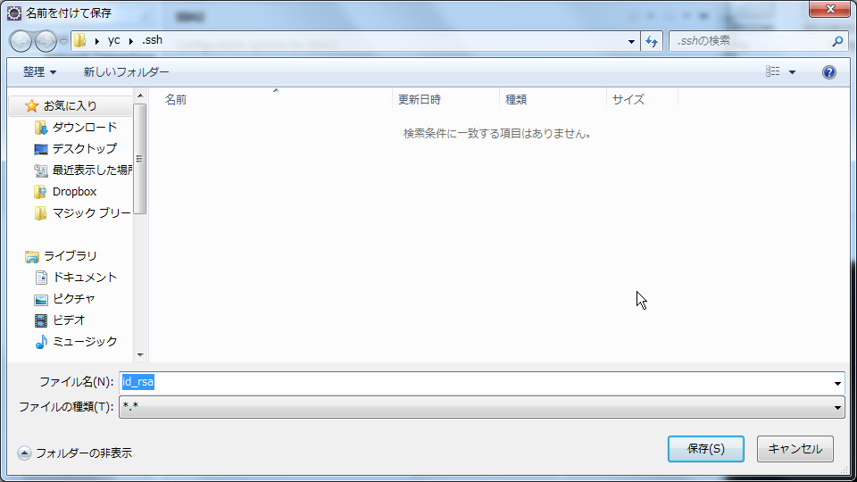

- Click **OK** button.

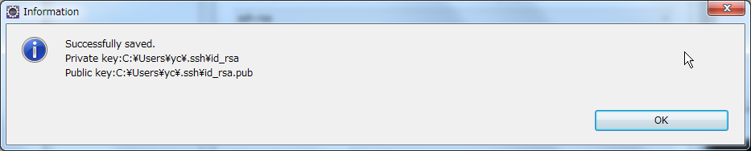

- Click **OK** button.

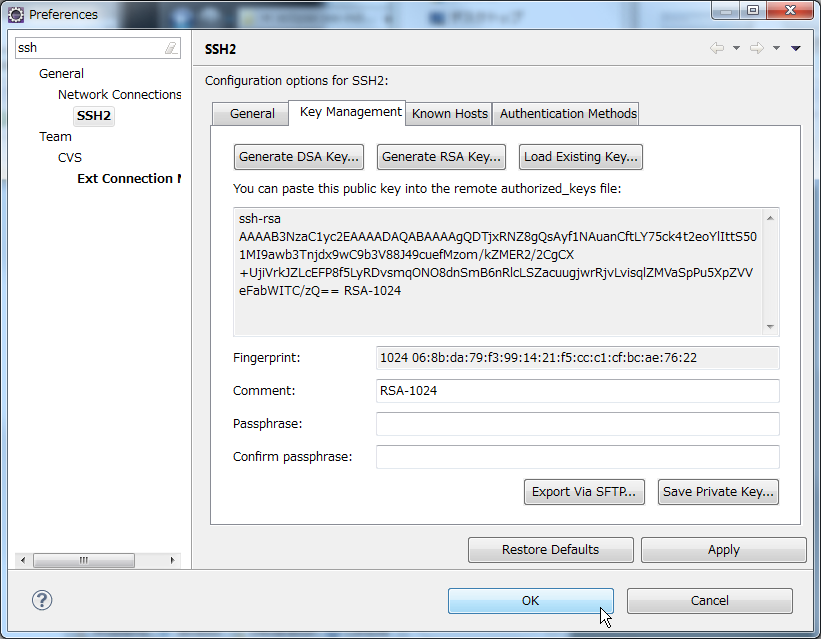

- Click **OK** button.

Exercise
--------

#. Find .ssh folder and check your SSH keys.

References
----------

- http://wiki.eclipse.org/EGit/User_Guide/Remote

