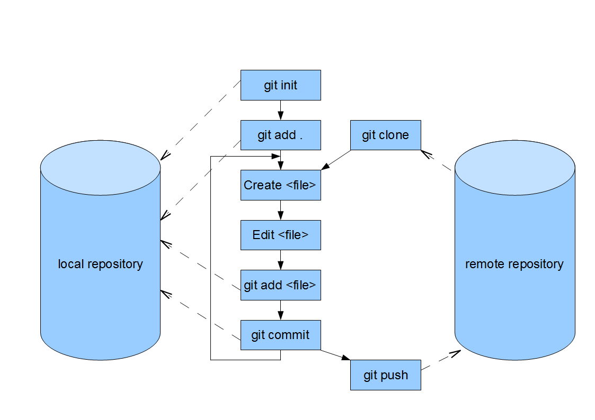

git - command line tool
=======================

http://www8.atwiki.jp/git_jp/pub/git-manual-jp/Documentation/gittutorial.html

Git overview
------------

::

  # git init
  # git add .
  # git commit -m 'Initial commit'
  # git push https://user@code.google.com/p/rstmemo/ master
  Password:

Refferences
-----------

- [jp] http://d.hatena.ne.jp/hiratara/20090113/1231810740
