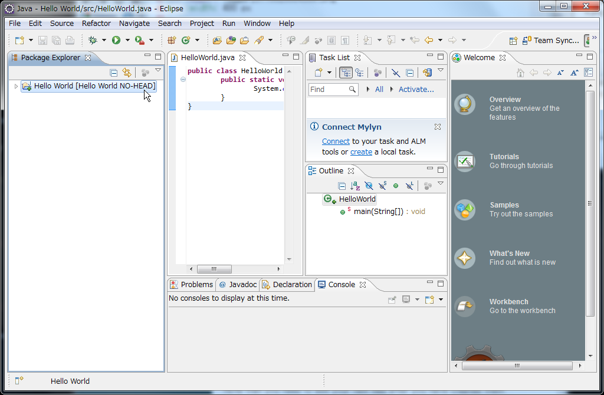

.. include:: define.rst

Local Repository
================

Creating Local Repository
-------------------------

At first, create your local repository for git.
Now your working tree (a set of source codes) are in 'workspace' foleder under the |user home| directory.  After you finish following operation, your working tree will be moved to |git repository| by Eclipse.

- Start Eclipse.

.. image:: image/20110826003231.png
   :width: 480 px

- Right-click on your *Hello World* project in Package Explorer.
- Choose **Team -> Share Projects**.

.. image:: image/20110826003650.png
   :width: 480 px

- Select **Git**.
- Click **Next**.

.. image:: image/20110826003842.png
   :width: 480 px

- Click **Create** button.

.. image:: image/20110826003939.png
   :width: 480 px

- Type 'Hello World' at **Name** text field.

.. image:: image/20110826004306.png
   :width: 480 px

- Click **Finish** button.

.. image:: image/20110826004509.png
   :width: 480 px

- Click **Finish** button.

.. image:: image/20110826004615.png
   :width: 480 px

Check that your project name 'Hello World' is now followed by '[Hello World NO-Head'.  This means your working tree has been moved into the git folder under the |user home| directory.

Adding Files to Local Repository
--------------------------------
Your files in the 'Hello World' project are not under controlled by git.  'Add' operation make your files under-controlled.

Note that you need to add your new files after you have created them.

- Right-click **Hello World** project item.
- Choose **Team -> Add**.

The tiny icon at your 'Hello World' has been changed.

Commiting Files to Local Repository
-----------------------------------
You can commit your files to your local repository.

- Right-click **Hello world** project item.
- Choose **Team -> Commit** menu.

.. image:: image/20110826011350.png
   :width: 480 px

- Input your commit message, 'Initial commit' in **Commit Message** text area.

.. image:: image/20110826011516.png
   :width: 480 px

- Click **Commit** button.

.. image:: image/20110826011700.png
   :width: 480 px

You will find that '[Hello World NO-HEAD]' message has changed to '[Hello World master]'.

The combination of 'Add' and 'Commit' operations is used frequently.

Exercise
--------

#. Add and Commit a new file

  a. Create 'README.txt' file in your Project

  #. Add it to your local repository

  #. Then, Commit it.
