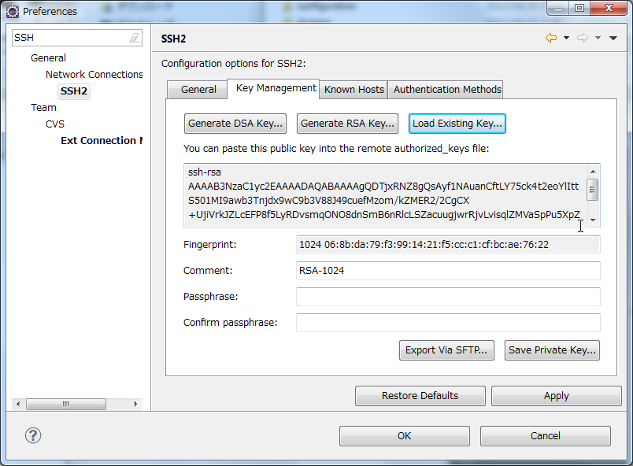
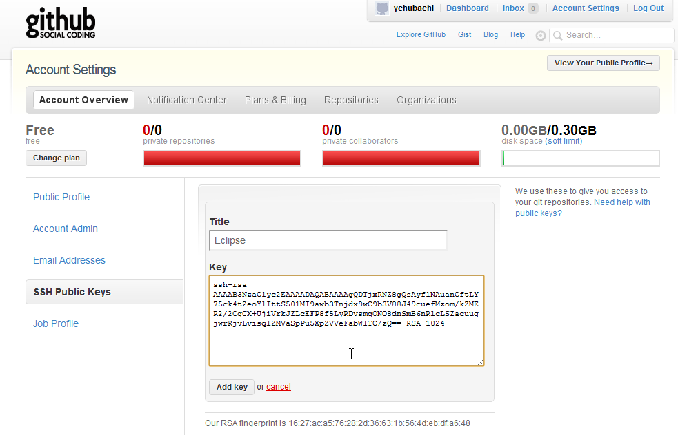
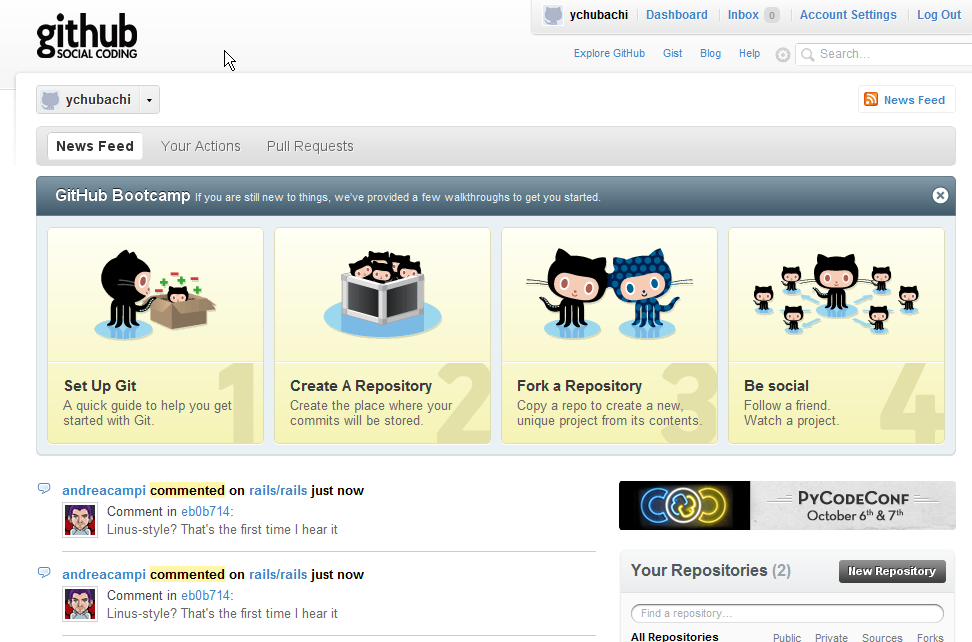
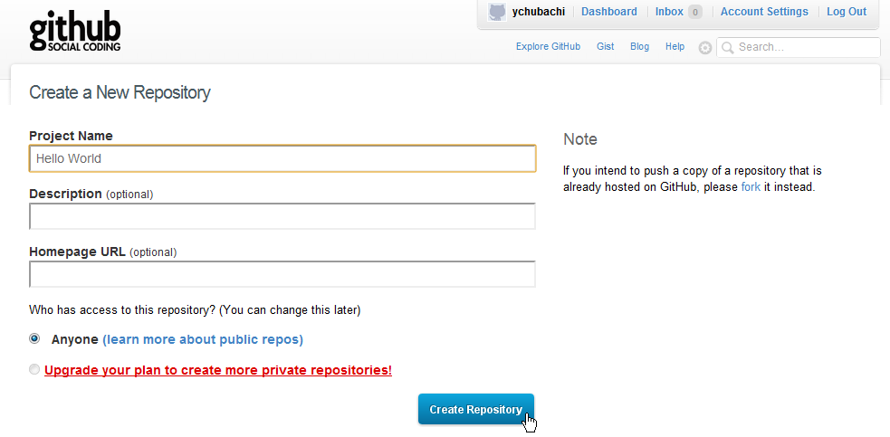

.. include:: define.rst

GitHub
======

Learning GitHub
---------------

Go to `Set Up Git <http://help.github.com/win-set-up-git/>`_ and follow the instructions.

Local Repository
----------------

At first, create your local repository for git.
Now your working tree (a set of source codes) are in 'workspace' foleder under the |user home| directory.  After you finish following operation, your working tree will be moved to |git repository| by Eclipse.

- Start Eclipse.

- Right-click on your *Hello World* project in Package Explorer.
- Choose **Team -> Share Projects**.

- Select **Git**.
- Click **Next**.

.. image:: image/20110826003842.png
   :width: 480 px

- Click **Create** button.

- Type 'Hello World' at **Name** text field.

.. image:: image/20110826004306.png
   :width: 480 px

- Click **Finish** button.

- Click **Finish** button.

Check that your project name 'Hello World' is now followed by '[Hello World NO-Head'.  This means your working tree has been moved into the git folder under the |user home| directory.

Working with your Local Repository
----------------------------------

Adding Files to Local Repository
~~~~~~~~~~~~~~~~~~~~~~~~~~~~~~~~
Your files in the 'Hello World' project are not under controlled by git.  'Add' operation make your files under-controlled.

Note that you need to add your new files after you have created them.

- Right-click **Hello World** project item.
- Choose **Team -> Add**.

.. image:: image/20110826010315.png
   :width: 480 px

The tiny icon at your 'Hello World' has been changed.

Commiting Files to Local Repository
~~~~~~~~~~~~~~~~~~~~~~~~~~~~~~~~~~~
You can commit your files to your local repository.

- Right-click **Hello world** project item.
- Choose **Team -> Commit** item.

- Input your commit message, 'Initial commit' in **Commit Message** text area.

- Click **Commit** button.

You will find that '[Hello World NO-HEAD]' message has changed to '[Hello World master]'.

The combination of 'Add' and 'Commit' operations is used frequently.

Remote Repository
-----------------

Prepare Resistering SSH key
~~~~~~~~~~~~~~~~~~~~~~~~~~~
- With your web browser, Go to GitHub web page.
- Log-in with your account.

.. image:: image/20110826013013.png
   :width: 480 px

- Click **Account Settings** link.

.. image:: image/20110826013448.png
   :width: 480 px

- Click **SSH Pblic Keys** link.

.. image:: image/20110826014140.png
   :width: 480 px

- Click **Add another public key** link.

.. image:: image/20110826014441.png
   :width: 480 px

- Type 'Eclipse' in **Title** text field.

.. image:: image/20110826014626.png
   :width: 480 px

Keep your web browser opened.

Copy & Pase SSH key
~~~~~~~~~~~~~~~~~~~
Bring back to Eclipse.

- Choose **Window -> Preferences**

- Type 'SSH' at filter text field.

- Select **SSH** item.

- Click **Key Management** tab.

.. image:: image/20110826015906.png
   :width: 480 px

- Click **Load Existing Key..** tab.

.. image:: image/20110826020333.png
   :width: 480 px

- Choose your **id_rsa** file (Not *id_rsa.pub*).
- Click **Open** button.

- Select the key in the text area.
- Copy it to your clipboard.
- Click **Cancel** button.

.. image:: image/20110826020706.png
   :width: 480 px

- Bring back to your web browser.
- Paste your key to **Key** text area.

- Click **Add key** button.

.. image:: image/20110826021208.png
   :width: 480 px

Now, your SSH key generated by Eclipse has been resistered to GitHub account.

Create your Remote Repository
~~~~~~~~~~~~~~~~~~~~~~~~~~~~~
- Go back to the top page of GitHub.

- Push **New Repository** button.

- Enter your project name, 'Hello World".

- Push **Create Repository** button.

.. image:: image/20110826105014.png
   :width: 480 px

