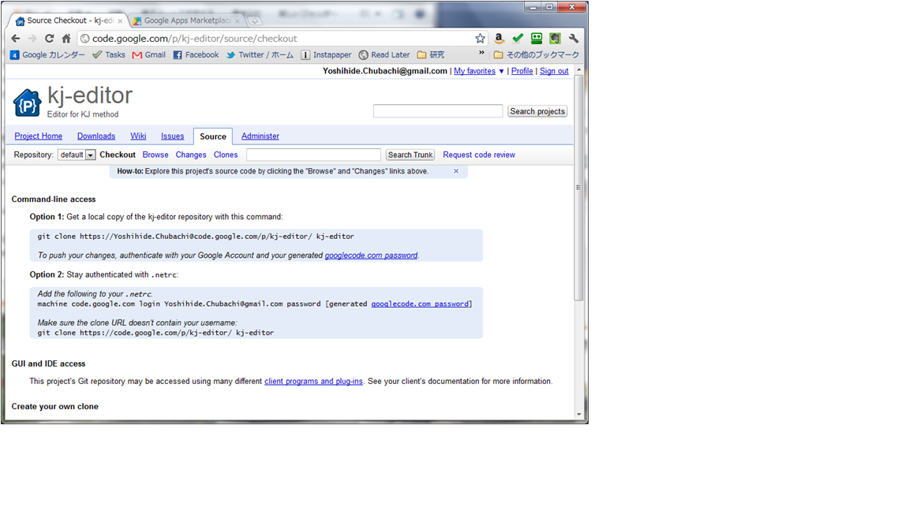

Google Project Hosting (OPTIONAL)
=================================

Google Project Hosting
----------------------
About Google Project Hosting

- http://code.google.com/p/support/wiki/GettingStarted

Create a new project
--------------------

Create a new project.

- http://code.google.com/hosting/

Click "Create a new Project".

We use **SVN** for team code sharing

Example
-------

Using Wiki
----------

Exercise
--------

#. Edit your wiki page.
#. Add your friend to project members.
#. Edit your friend's wiki page.
#. Learn more about licences.

Generate your password for GPH
------------------------------

Push your project to GPH
------------------------

Exercise
--------
#. Edit your friend's source code and commit it.
